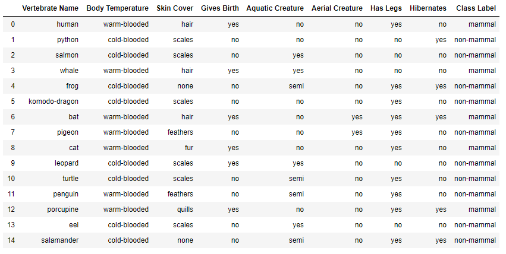
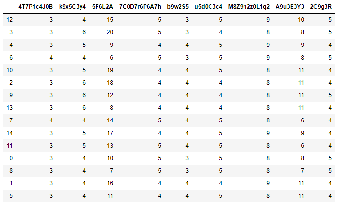
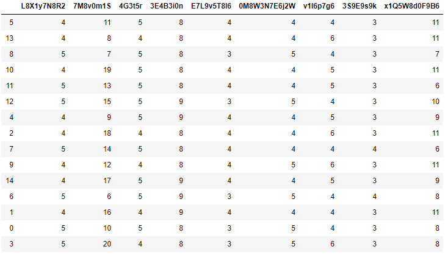
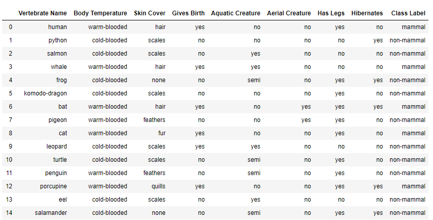

The primary contact for this for this project is Nick Hopewell  
<Nicholas.Hopewell@cic.gc.ca>    

# PyAnon 
---  

pyanon is module designed to anonymize data (which may or may not be secret in some way) and store the mapping (called the key) of the original data and masked data. 

This key serves 2 primary purposes:  
* 1) To abstract the sensitivity out of the data and into the key itself.  
* 2) To use to map the anonymized data back to its original state.   

A side effect of this masking process is that any products resulting from the anonymized data will also be masked (such as rules derived from modeling the data in some way).  

## Example application  

Running the encoding algorithm on the following dataframe:  
   

  
   

Will produce something similar to this: 
   

  
   

Not that every time this dataframe is encoded, it will look different. For instance, here is the same dataframe encoded again with the encoding algorithm: 
   

  

Column names, values, row indecies, and column order are randomized every encoding so that the same data looks different each time it is encoded. Furthermore, a new key is generated each time data is encoded. So if these data were encoded once per day and sent to the cloud, it would look different every day and a new key would be created every day.  This results in any model rules coming out as masked and different every time the data is encoded.

We can use the key generated during encoding to unmask the anonmyized data locally (as it returns from the cloud) while the decoding algorithm executes. Unmasking the data returns it to the correct state as long as the user has the correct key:   
   

  

